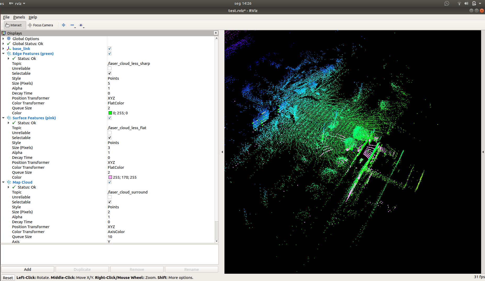

# Metas de software reajustadas (01/07/2019)

## Estado atual do processo

O processo descrito é aplicado no fork do [LOAM](https://github.com/tiagodc/loam_velodyne) no meu repositório do GitHub. O código não foi alterado em relação ao [original](https://github.com/laboshinl/loam_velodyne), sendo apenas uma cópia do último commit estável.

## Etapas na utilização do LOAM com LiDAR+IMU
1. Coleta de dados brutos em formato .bag
  - tópicos brutos do liDAR: `/velodyne_points`
  - tópicos brutos do IMU: `/ekf_quat`, `/imu_data`
2. Conversão das [mensagens dos tópicos brutos](https://wiki.ros.org/sbg_driver) do IMU (SBG ellipse A) em [mensagens genéricas](https://docs.ros.org/api/sensor_msgs/html/msg/Imu.html) do ROS
- Salvar as mensagens do IMU convertidas no tópico `/imu/data` em um novo arquivo .bag
  - Salvar no .bag também as mensagens brutas do LiDAR sem alterar o nome do tópico
3. Executar o LOAM: `roslaunch loam_velodyne loam_velodyne.launch`
4. Dar *play* no bag convertido. Ex.: `rosbag play converted_data.bag -r 0.25`
  - O parâmetro `-r` (ratio) serve para alterar a taxa de execução do arquivo, e rodando o .bag em slow motion o resultado fica melhor, gerando uma nuvem de pontos pontos mais coesa e densa
5. Armazenar os tópicos contendo os resultados de interesse. Vários tópicos são publicados como output do LOAM, atualmente utilizamos 2 deles:
  - `/integrated_to_init`: informações de localização e orientação do setup de escaneamento (x,y,z,roll,pitch,yaw) calculadas pelo SLAM
  - `/velodyne_cloud_registered`: frames de nuvem de pontos (XYZ) com posição e orientação corrigidos para um único sistema de referência - cada *frame* equivale a um giro do LiDAR
6. Exportar todos os frames de nuvem de pontos extraídos do `/velodyne_cloud_registered` para conferência da qualidade do corregistro
  - exportar para .pcd, .laz ou outro formato 3D otimizado para nuvem de pontos

## Desafios

Como mencionado, o processo SLAM que utilizamos é uma versão desatualizada do LOAM. Temos 3 boas alternativas de SLAM que já vimos em funcionamento, porém em 2 delas não consegui utilizar ou extrair os dados de nuvem de pontos de forma ideal. Os 3 algoritmos que iremos trabalhar são:
- [LOAM desatualizado](https://github.com/tiagodc/loam_velodyne): será a referência de controle de qualidade dos dados, pois é o processo que usamos atualmente
- [LOAM atualizado](https://github.com/laboshinl/loam_velodyne): versão mais atual do LOAM, com código refatorado e algumas correções e melhorias do processo. Abaixo seguem algumas observações da minha experiência até agora com o LOAM mais recente:
  - A infra estrutura de código (C++) foi bastante alterada, mas de forma a melhorar a legibilidade e particionamento do código. Até onde observei, as estruturas publicadas no ROS não foram alteradas ou renomeadas, portanto, os tópicos de interesse devem ser exatamente os mesmos para ambas as versões do LOAM
  - Consigo gerar boas nuvens de pontos se fornecer de input apenas os dados do LiDAR, porém quando forneço o IMU de input, pelo tópico `/imu/data`, o SLAM se perde completamente. Imagino que alguma coisa tenha sido alterada no código fonte em relação aos eixos de orientação dos sensores, a exemplo de serem intercambiados os eixos Y e Z, inversão de algum eixo (ex. transformar X em -X), ou algo similar. Precisamos mapear essa mudança para conseguir utilizar a versão mais recente do LOAM fornecendo também com os dados do IMU como input
- [LeGO-LOAM](https://github.com/RobustFieldAutonomyLab/LeGO-LOAM): adaptação do LOAM para utilização em locais com terreno variável (*Lightweight and Ground-Optimized Lidar Odometry and Mapping*). Seguem minhas observações:
  - Consegui rodar e vi o SLAM funcionando com sucesso, com inputs de ambos LiDAR+IMU ou só LiDAR, porém não consegui exportar a nuvem de pontos dos tópicos publicados no processo. Construí a nuvem de pontos com o que exportei dos tópicos `/laser_cloud_less_sharp`, `laser_cloud_less_flat` e `laser_cloud_surround`, que são os mesmos listados no RViz ao construir a cena 3D (Figura 1). Imagino 3 alternativas do porquê isso ocorreu:
    - Não exportei os tópicos corretos para conversão em nuvem de pontos ou
    - A transformação de coordenadas das nuvens de pontos (que vemos no RViz) é feita *online*, e os frames de nuvem de pontos corrigidos não estão sendo publicados, apenas utilizados internamente

Figura 1: Tela do RViz durante processamento pelo LeGO-LOAM, com tópicos listados no paines à esquerda.

## Metas

O objetivo do projeto é sermos capazes de gerar nuvens de pontos de boa qualidade, de qualquer um dos 3 sistemas listados acima, e utilizando todos os equipamentos disponíveis por nós (LiDAR + IMU + GPS). As metas pontuais são traçadas abaixo, em ordem de prioridade, e com os respectivos prazos de entrega:

- (09/07/2019) Exportar output do LeGO-LOAM: identificar ou gerar os tópicos corretos para construção da nuvem de pontos corregistrada pós-SLAM
- (16/07/2019) Viabilizar uso do LOAM atualizado com os dados do IMU: identificar as alterações realizadas nos eixos e orientação do sensor nos cálculos internos do sistema, e verificar se necessárias e quais alterações devem ser feitas nos dados do IMU antes do input para o LOAM
- (30/07/2019) Exportar os dados de localização e orientação usados na transformação dos frames de nuvem de pontos
  - Atualmente entramos com os tópicos brutos dos sensores (`/velodyne_points` etc.) e exportamos os frames transformados diretamente do ROS (tópico `/velodyne_cloud_registered`). Idealmente só precisaríamos extrair exatamente a [matriz de transformação](https://en.wikipedia.org/wiki/Transformation_matrix) ou os dados de translação e rotação do LiDAR (x,y,z,roll,pitch,yaw) calculados pelo SLAM a cada frame de nuvem de pontos. Isso nos permite fazer as transformações necessárias fora do ambiente ROS, além de diversos testes e desenvolvimento de metodologias de correção de trajetória/posição após aplicação do SLAM.
  - Observei que as mensagens extraídas do tópico `/integrated_to_init` têm *time_stamps* correspondentes aos das mensagens do tópico `/velodyne_points`, portanto minha hipótese é de que `/velodyne_points` * `/integrated_to_init` = `/velodyne_cloud_registered`, porém quando gerei as matrizes de transformação (a partir de `/integrated_to_init`) e apliquei nas nuvens de pontos brutas, não obtive a nuvem corregistrada corretamente. Posso estar fazendo a transformação de forma errada, por conta de alguma inversão ou troca entre os eixos XYZ internamente nos cálculos realizados pelo LOAM. Precisamos mapear quais são essas alterações realizadas nos eixos dentro do código original e gerar as matrizes de transformação corretas para construção da nuvem de pontos corregistrada no pós-processamento, tanto para o LOAM como para o LeGO-LOAM. Há ainda a possibilidade de que as transformações sejam feitas apenas internamente, não havendo tópicos correspondentes sendo publicados e que correspondam à transformação efetuada em cada frame de nuvem, nesse caso `/integrated_to_init` não contém a mesma informação utilizada na correção dos frames de nuvem, apesar da sincronia dos time_stamps 
- (13/08/2019) Calibração do IMU: determinar metodologia para calibração do IMU usando ROS, e investigar se houve distorção de orientação dos dados coletados até agora
- (03/09/2019) Incluir GPS nos .bags coletados em campo: identificar os drivers adequados para publicação dos dados coletados pelo GPS da mochila, e criar os tópicos necessários para exportação do GPS junto do LiDAR e IMU nos arquivos .bag

As metas listadas acima têm absoluta prioridade, e envolvem majoriatariamente a mineração do código existente e extração/organização de dados que já estão sendo gerados. Uma vez cumpridas as metas acima listadas, o foco do projeto torna efetivamente às melhorias do sistema de SLAM que utilizaremos operacionalmente, que detalharemos nas próximas semanas, conforme avançarmos nas metas atuais. Resumidamente, poderemos ter 2 abordagens de melhoria, focando em melhorias diretas no algoritmo de SLAM do LOAM ou do LeGO-LOAM, ou em metodologias de correção no pós-processamento, em que corrigiríamos as nuvens de pontos após finalizado o processo de SLAM, usando teoria de graph ou heurísticas específicas para refinamento das matrizes de transformação.
